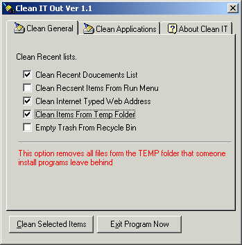



## Clean IT Out

### Description

Hi this is a little program that can remove Items left behinde by programs, It rmoves old files form the Temp folder., Removes Items form the Recent Doucemnts menu, Removes old Typed in web address form IE and Netscape. Removes Netscape cache, Clears Items form the Run Menu, Emptys the Recyle Bin And also has some more functions like a Simple but effect File Wipeing. anyway I hope you like this program and please Vote for Me...

Also please leve lots of comments.
 
### More Info
 

             |
---                |---
**Submitted On**   |2002-05-02 10:41:46
**By**             |[dreamvb](https://github.com/Planet-Source-Code/PSCIndex/blob/master/ByAuthor/dreamvb.md)
**Level**          |Advanced
**User Rating**    |5.0 (30 globes from 6 users)
**Compatibility**  |VB 6\.0
**Category**       |[Files/ File Controls/ Input/ Output](https://github.com/Planet-Source-Code/PSCIndex/blob/master/ByCategory/files-file-controls-input-output__1-3.md)
**World**          |[Visual Basic](https://github.com/Planet-Source-Code/PSCIndex/blob/master/ByWorld/visual-basic.md)
**Archive File**   |[Clean IT O202065292001\.zip](https://github.com/Planet-Source-Code/dreamvb-clean-it-out__1-23550/archive/master.zip)

